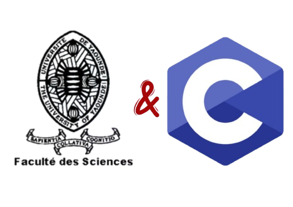
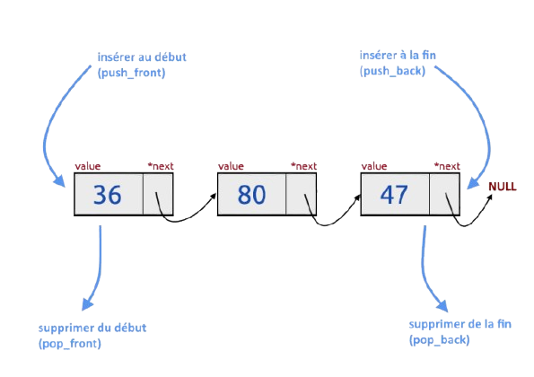
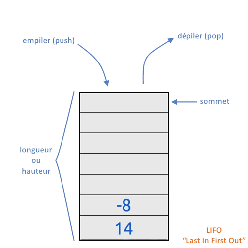
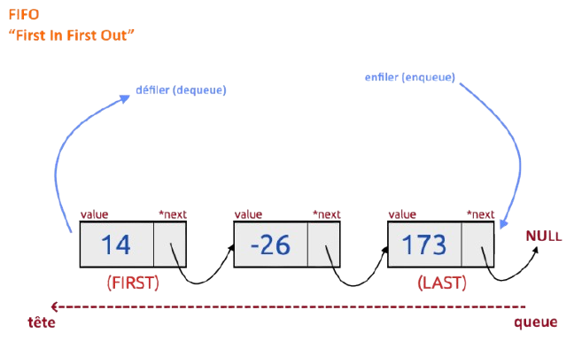
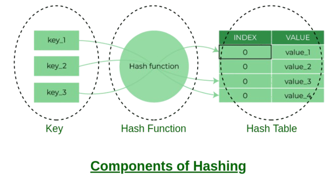

# Some Data Structure in C language

In the university context, learning C language is a prerequisite for success in certain subjects such as INF131, INF231... To make up for this deficit, I'm going to learn complex data structures in C (Stack, File, Lists...).

## Liste (List)

Une `liste` est une structure de données linéaire qui stocke des éléments de manière séquentielle. Les listes peuvent être statiques (*comme les tableaux*) ou dynamiques (comme *les listes chaînées*). Elles permettent un accès direct aux éléments via leur index. Les opérations courantes incluent l'insertion, la suppression et la recherche. Les listes sont utilisées dans des cas où un accès rapide à des éléments spécifiques est nécessaire, comme dans les implémentations de tableaux dynamiques (*ex : ArrayList en Java*) ou pour stocker des données ordonnées comme une liste d'éléments dans un panier d'achat.

**Caractéristiques** :

- Accès direct par index (dans les tableaux).
- Peut être ordonnée ou non.
- Taille fixe (tableaux) ou dynamique (listes chaînées).

**Exemple d'utilisation**: Stocker une liste de tâches dans une application de gestion de projets.

**Implémentation**:
./Liste

## Pile (Stack)

Une `pile` (ou `stack`) est une structure de données linéaire qui suit le principe *LIFO* (*Last In*, *First Out*), où le dernier élément ajouté est le premier à être retiré. Les opérations principales sont push (ajouter un élément) et pop (retirer le dernier élément). Une pile est utile pour des tâches nécessitant une gestion d'historique ou de récursivité, comme l'annulation d'actions dans un éditeur ou l'évaluation d'expressions mathématiques.

**Caractéristiques** :

- Accès uniquement au sommet de la pile.
- Ordre LIFO.
- Facile à implémenter avec des tableaux ou des listes chaînées.

**Exemple d'utilisation** : Gérer les appels de fonctions dans une pile d'exécution ou naviguer entre les pages précédentes/suivantes d'un navigateur.

**Implémentation**:
./Pile

## File (Queue)

Une `file` (ou `queue`) est une structure de données linéaire qui suit le principe FIFO (First In, First Out), où le premier élément ajouté est le premier à être retiré. Les opérations principales sont enqueue (ajouter un élément à la fin) et dequeue (retirer un élément du début). Les files sont utilisées pour gérer des processus ou des tâches dans l'ordre où elles arrivent, comme dans les files d'attente des systèmes d'impression ou la gestion des requêtes dans un serveur.

**Caractéristiques**:

- Ordre FIFO.
- Accès aux éléments uniquement au début (pour retirer) et à la fin (pour ajouter).
- Variantes : files prioritaires et files circulaires.

**Exemple d'utilisation** : Gestion des tâches dans un système d'exploitation ou traitement des requêtes HTTP dans un serveur web.

**Implémentation**:
./File

## Table de Hashage

Une table de hachage est une structure de données qui permet de stocker des paires clé-valeur pour un accès rapide. Elle repose sur une fonction de hachage qui convertit une clé en un indice dans un tableau.

**Avantages :**

- Accès rapide aux données (en moyenne O(1)).
- Pratique pour les recherches, les insertions et les suppressions.

**Inconvénients :**

- Les performances dépendent de la qualité de la fonction de hachage.
- Risque de collisions (deux clés différentes générant le même indice).

